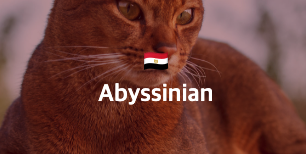

## Cat Gallery

- 고양이 사진 갤러리

---

### 설명

- CRA를 사용한 React 프로젝트
- Redux를 사용한 전역 상태관리 (Ducks 패턴 사용)
- Cat API를 통한 데이터 통신
- 검색어 자동완성 기능 구현 (검색어 두글자 이상시 동작)
- 검색시 고양이 리스트 출력

---

### 실행 방법

- 터미널 실행 후 원하는 폴더 경로로 이동
- `git clone https://github.com/peppermintc/cat-gallery.git` 명령어로 프로젝트 클론
- `cd cat-gallery` 명령어로 경로 이동
- `yarn install` 명령어로 node_modules 설치
- `yarn start` 명령어로 3000번 포트에서 프로젝트 실행

---

### 사용 라이브러리

- React: UI 컴포넌트 구현
- TypeScript: 타이핑
- Styled-components: 스타일
- Redux: 상태관리
- Redux-thunk: 비동기 상태관리
- axios: HTTP 통신

---

### 프로젝트 구조

```
src
  api         // HTTP 통신
  components  // UI 컴포넌트
  hooks       // 커스텀 훅
  img         // 사진 폴더
  modules     // Redux 상태관리
  styles      // 전역 스타일
```

---

### Redux State

```
{
  cat: {
    catList,  // 검색 결과
    autoComplete  // 검색 자동 완성
  }
}
```

---

### Cat API

- Method: GET
- URL: https://api.thecatapi.com/v1/breeds
- response: 모든 고양이 종 리스트

---

- Method: GET
- URL: https://api.thecatapi.com/v1/breeds/search
- Query String:
  - q: 검색 키워드
- response: 검색한 고양이 종 리스트

### Flag API

- Method: GET
- URL: https://flagcdn.com/24x18/{country_code}.png
- response: 국기 이미지

---

### 추가 기능

- 고양이 종 정보 중 `country_code` 항목과 `flagcdn API`를 사용하여 국기 표시

  
